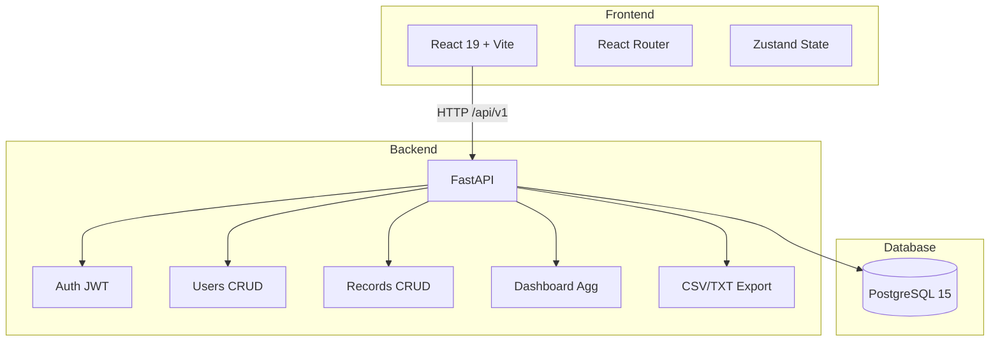
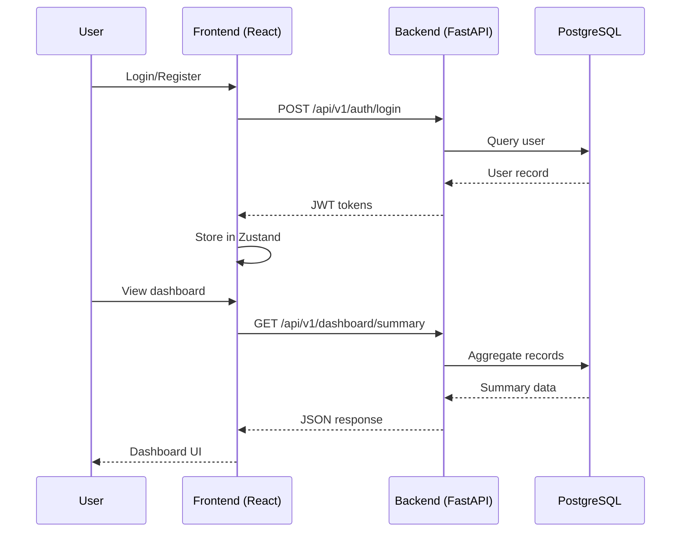

# FinTrack MVP

A Dockerized finance tracker with FastAPI backend and React frontend. Track income/expenses, view analytics, export data, and manage users.

**Repository:** https://github.com/Zburgers/obsidian-ledger

## Architecture



### Component Flow



## Quick Start

### Prerequisites

- Docker + Docker Compose
- Python 3.12+ (for local dev)
- Node 22+ (for local dev)

### One-Command Startup

```bash
# Start all services
docker compose up -d --build

# Run migrations
docker compose exec backend uv run alembic upgrade head

# Seed demo data
docker compose exec -w /app -e PYTHONPATH=/app backend .venv/bin/python scripts/seed_demo_data.py

# Open the app
# Frontend: http://localhost:5173
# API docs: http://localhost:8000/docs
```

### Seeding Demo Data

The project includes a seed script that creates demo users and realistic financial transaction data for testing and development.

#### Demo Users Created

| Email | Password | Role | Purpose |
|-------|----------|------|---------|
| `admin@demo.com` | `Admin123!` | Admin | Full access, can manage users and records |
| `analyst@demo.com` | `Analyst123!` | Analyst | Can view own records and analytics |
| `viewer@demo.com` | `Viewer123!` | Viewer | Read-only access to own records |

#### Demo Data Generated

- **1,202 Financial Records**: Randomized transactions distributed across ~240 days
  - 446 income transactions (38%): salary, bonus, interest, refunds, etc.
  - 756 expense transactions (62%): rent, utilities, groceries, entertainment, etc.
  - Amounts range: income ($250-$4,500), expenses ($18-$1,450)
  - All records owned by `admin@demo.com` for analytics testing

#### Running the Seed Script

**Normal mode** (creates users/records only if missing):
```bash
docker compose exec -w /app -e PYTHONPATH=/app backend .venv/bin/python scripts/seed_demo_data.py
```

**Fresh mode** (deletes all existing data and reseeds):
```bash
docker compose exec -w /app -e PYTHONPATH=/app backend .venv/bin/python scripts/seed_demo_data.py --fresh
```

#### Verification

Check that the data was created:
```bash
# View users
docker exec zorvyn-db-1 psql -U fintrack -d fintrack -c "SELECT email, role FROM users WHERE is_deleted = false;"

# View record count
docker exec zorvyn-db-1 psql -U fintrack -d fintrack -c "SELECT COUNT(*) FROM records WHERE is_deleted = false;"

# View record distribution by type
docker exec zorvyn-db-1 psql -U fintrack -d fintrack -c "SELECT record_type, COUNT(*) FROM records WHERE is_deleted = false GROUP BY record_type;"
```

### Local Development (without Docker)

```bash
# Backend
cd backend
uv sync
DATABASE_URL="sqlite+aiosqlite:///./dev.db" SECRET_KEY="dev-key" uv run uvicorn app.main:app --reload

# Frontend
cd frontend
npm install
npm run dev
```

## Environment Variables

| Variable | Required | Default | Description |
|----------|----------|---------|-------------|
| `DATABASE_URL` | Yes | - | PostgreSQL connection string |
| `SECRET_KEY` | Yes | - | JWT signing key (min 32 chars) |
| `ACCESS_TOKEN_EXPIRE_MINUTES` | No | `15` | Access token lifetime |
| `REFRESH_TOKEN_EXPIRE_DAYS` | No | `7` | Refresh token lifetime |
| `RATE_LIMIT_PER_MINUTE` | No | `60` | Global rate limit |
| `CORS_ORIGINS` | No | `["http://localhost:5173"]` | Allowed origins (JSON array) |

## Role Behavior

| Role | Create Records | View All Records | Manage Users | Export Data |
|------|---------------|------------------|--------------|-------------|
| **Viewer** | No | Own only | No | Own only |
| **Analyst** | No | Own only | No | Own only |
| **Admin** | Yes | All | Yes | All |

## API Endpoints

### Auth
- `POST /api/v1/auth/register` - Register new user (auto viewer)
- `POST /api/v1/auth/login` - Login, returns tokens
- `POST /api/v1/auth/refresh` - Refresh access token
- `GET /api/v1/auth/me` - Current user info

### Users (Admin only)
- `GET /api/v1/users` - List users (paginated)
- `POST /api/v1/users` - Create user
- `PATCH /api/v1/users/:id` - Update user
- `DELETE /api/v1/users/:id` - Soft delete user

### Records
- `GET /api/v1/records` - List records (filtered, paginated)
- `POST /api/v1/records` - Create record (admin only)
- `GET /api/v1/records/:id` - Get record detail
- `PATCH /api/v1/records/:id` - Update record (admin only)
- `DELETE /api/v1/records/:id` - Soft delete record (admin only)

### Dashboard
- `GET /api/v1/dashboard/summary` - Income/expense totals
- `GET /api/v1/dashboard/by-category` - Category breakdown
- `GET /api/v1/dashboard/trends` - Monthly trends
- `GET /api/v1/dashboard/recent` - Recent records

### Export
- `GET /api/v1/export/csv` - Download CSV
- `GET /api/v1/export/txt` - Download text report

Full OpenAPI spec: `http://localhost:8000/openapi.json`

## Testing

```bash
# All tests
make test

# Backend only
cd backend && uv run pytest -v

# Frontend only
cd frontend && npm test -- --run

# TypeScript + build
cd frontend && npx tsc -b && npx vite build
```

## Project Structure

```
├── backend/
│   ├── app/
│   │   ├── api/v1/       # Route handlers
│   │   ├── core/          # Config, security, rate limiting, errors
│   │   ├── db/            # SQLAlchemy engine, session, base
│   │   ├── dependencies/  # Auth, permissions
│   │   ├── models/        # SQLAlchemy models (User, Record)
│   │   ├── schemas/       # Pydantic request/response schemas
│   │   └── services/      # Business logic
│   ├── alembic/           # Database migrations
│   └── tests/             # Integration + unit tests
├── frontend/
│   ├── src/
│   │   ├── features/      # Feature modules (auth, users, records, dashboard)
│   │   ├── lib/           # API client, shared utilities
│   │   ├── types/         # Generated OpenAPI types
│   │   └── test/          # Test setup
│   └── scripts/           # Type generation
├── scripts/               # Seed demo data
├── docker-compose.yml
└── Makefile
```
