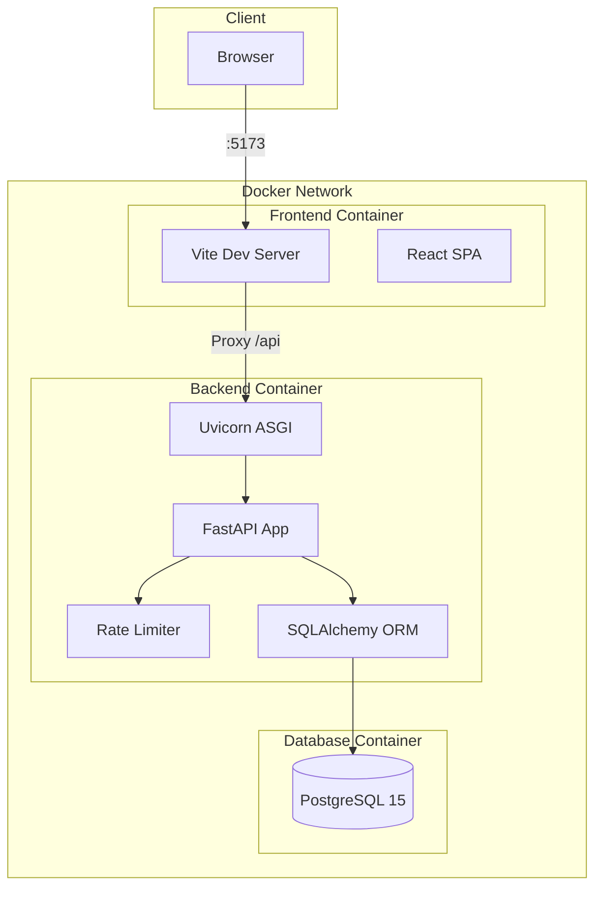
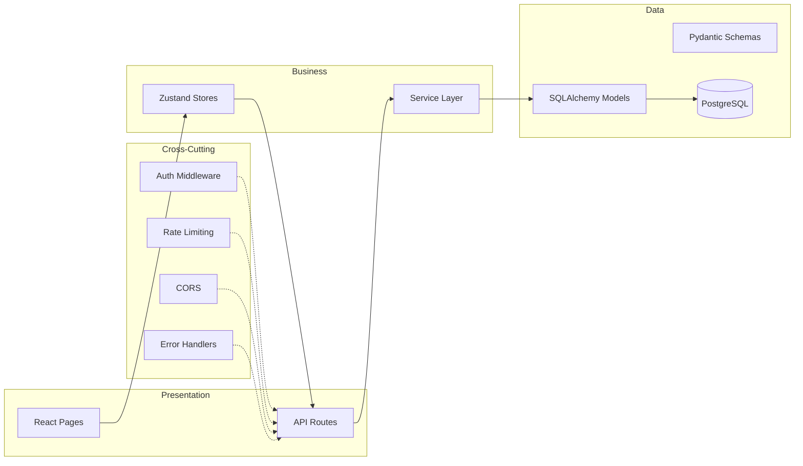
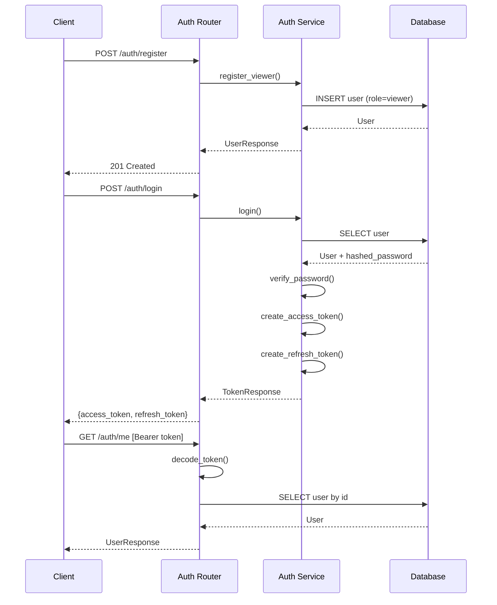
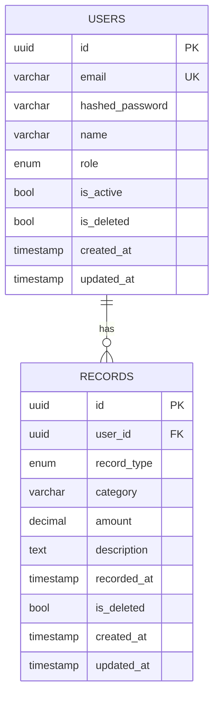
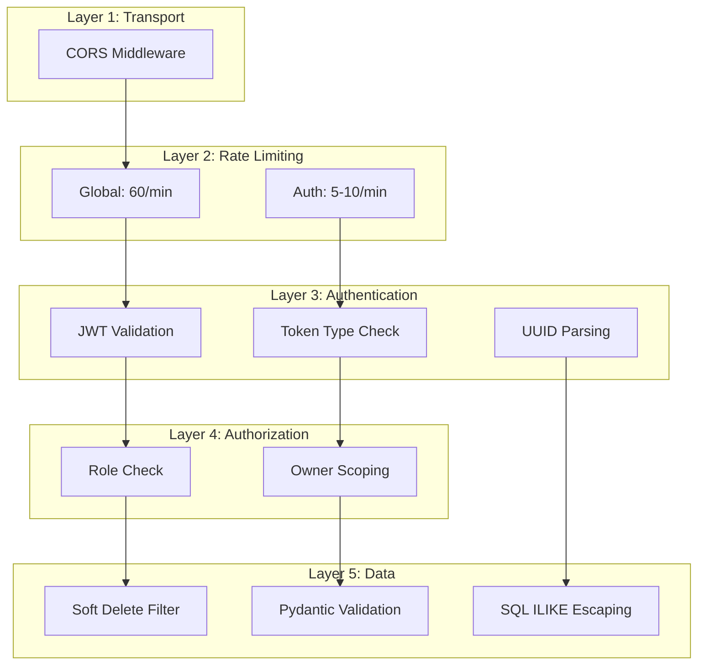

# Architecture

## System Overview

FinTrack is a finance tracking application with a clear separation between backend API and frontend UI.



## Layered Architecture



## Authentication Flow



## Data Model



## Security Layers



## Role and Capability Separation

The role system is enforced backend-first through explicit capability checks:

- `viewer`: report mode only (summary, recent records, basic record filters, exports)
- `analyst`: viewer capabilities + insights mode (category breakdown, trends, monthly comparison, advanced record filters)
- `admin`: analyst capabilities + mutation/admin controls (create/update/delete records, user management)

Authorization is checked at API dependency level, not only in frontend presentation:

- Dashboard insights endpoints (`/dashboard/by-category`, `/dashboard/trends`, `/dashboard/comparison`) require analyst-or-admin capability.
- Record listing allows all roles, but advanced query predicates (`search`, `amount_min`, `amount_max`) are guarded for analyst-or-admin only.

Frontend mirrors these capabilities so Viewer UI stays read-only and does not expose analyst interaction controls.

## Deployment

```mermaid
graph LR
    subgraph Development
        DevBE[Backend :8000]
        DevFE[Frontend :5173]
        DevDB[(PostgreSQL :5432)]
    end

    subgraph Production
        ProdBE[Backend (gunicorn)]
        ProdFE[Frontend (nginx)]
        ProdDB[(Managed PostgreSQL)]
    end

    DevBE --> DevDB
    DevFE -->|Proxy| DevBE
    ProdFE --> ProdBE
    ProdBE --> ProdDB
```
